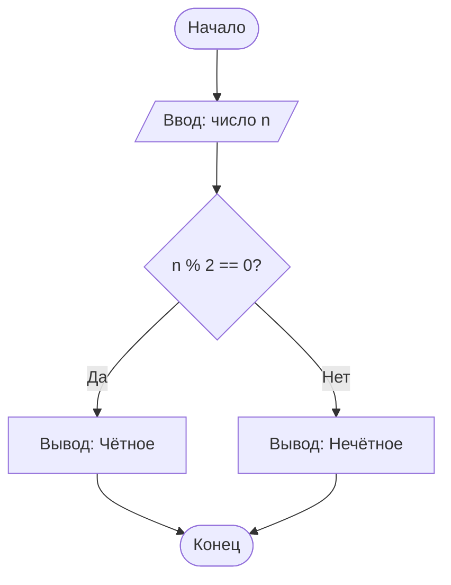

# Блок-схемы (Flowcharts)

## Что такое блок-схема?

**Блок-схема** — это графическое представление алгоритма, использующее стандартные геометрические фигуры для обозначения различных типов операций и стрелки для показа последовательности выполнения.

Блок-схемы помогают визуализировать логику программы и делают алгоритм понятным без знания языка программирования.

## Основные символы блок-схем

### 1. Терминатор (Начало/Конец)

```
    ╭─────────────╮
    │   НАЧАЛО    │
    ╰─────────────╯
```

**Овал (скруглённый прямоугольник)** — обозначает начало или конец алгоритма.

### 2. Процесс (Действие)

```
    ┌─────────────────┐
    │   a = a + 1     │
    └─────────────────┘
```

**Прямоугольник** — обозначает выполнение операции или действия.

### 3. Условие (Решение)

```
          ╱╲
         ╱  ╲
        ╱    ╲
       ╱ a > b ╲
       ╲      ╱
        ╲    ╱
         ╲  ╱
          ╲╱
        Да │ Нет
```

**Ромб** — обозначает условие (ветвление). Имеет один вход и два выхода (Да/Нет или True/False).

### 4. Ввод/Вывод

```
    ╱─────────────────╲
   ╱   Ввод: число     ╲
  ╱_____________________╲
```

**Параллелограмм** — обозначает операции ввода или вывода данных.

### 5. Предопределённый процесс (Подпрограмма)

```
    ┌──┬───────────┬──┐
    │  │ Функция() │  │
    └──┴───────────┴──┘
```

**Прямоугольник с вертикальными линиями** — обозначает вызов функции или подпрограммы.

### 6. Соединитель

```
       ╭───╮
       │ A │
       ╰───╯
```

**Маленький круг** — используется для соединения частей схемы на одной странице.

### 7. Стрелки (Линии потока)

```
    ──────────────>
          │
          │
          ▼
```

**Стрелки** показывают направление выполнения алгоритма.

## Сводная таблица символов

| Символ | Название | Назначение |
|--------|----------|------------|
| Овал | Терминатор | Начало/Конец |
| Прямоугольник | Процесс | Действие, операция |
| Ромб | Решение | Условие (if/else) |
| Параллелограмм | Ввод/Вывод | Данные |
| Двойной прямоугольник | Подпрограмма | Вызов функции |
| Круг | Соединитель | Связь частей схемы |
| Стрелка | Линия потока | Направление |

## Правила построения блок-схем

### 1. Общие правила

- Блок-схема имеет один блок "Начало" и один (или несколько) блоков "Конец"
- Линии потока идут сверху вниз и слева направо
- Каждый блок соединён с другими стрелками
- Стрелки не должны пересекаться (если возможно)

### 2. Правила для условий

- У ромба один вход (сверху) и два выхода (обычно вправо и вниз)
- Выходы подписываются: "Да/Нет", "True/False", "+/-"

### 3. Правила для циклов

- Циклы образуют замкнутый контур со стрелкой, возвращающейся назад
- Условие выхода из цикла указывается в ромбе

## Примеры блок-схем

### Пример 1: Определение чётности числа

```
        ╭─────────────╮
        │   НАЧАЛО    │
        ╰──────┬──────╯
               │
               ▼
      ╱────────────────╲
     ╱  Ввод: число n   ╲
    ╱____________________╲
               │
               ▼
           ╱────╲
          ╱      ╲
         ╱ n % 2  ╲
         ╲ == 0 ? ╱
          ╲      ╱
           ╲────╱
         Да │    │ Нет
            │    │
     ┌──────┘    └──────┐
     ▼                  ▼
┌─────────┐      ┌───────────┐
│ "Чётное"│      │"Нечётное" │
└────┬────┘      └─────┬─────┘
     │                 │
     └────────┬────────┘
              ▼
        ╭─────────────╮
        │    КОНЕЦ    │
        ╰─────────────╯
```

**Код на Python:**

```python
n = int(input("Введите число: "))

if n % 2 == 0:
    print("Чётное")
else:
    print("Нечётное")
```

### Пример 2: Цикл — сумма чисел от 1 до N

```
        ╭─────────────╮
        │   НАЧАЛО    │
        ╰──────┬──────╯
               │
               ▼
      ╱────────────────╲
     ╱    Ввод: N       ╲
    ╱____________________╲
               │
               ▼
        ┌───────────┐
        │ сумма = 0 │
        │  i = 1    │
        └─────┬─────┘
              │
              ▼
          ╱────╲
         ╱      ╲
        ╱ i <= N  ╲─────────┐
        ╲   ?    ╱   Нет    │
         ╲      ╱           │
          ╲────╱            │
         Да │               │
            ▼               │
     ┌──────────────┐       │
     │сумма = сумма │       │
     │    + i      │       │
     └──────┬───────┘       │
            │               │
            ▼               │
     ┌──────────────┐       │
     │  i = i + 1   │       │
     └──────┬───────┘       │
            │               │
            └───────────────┤
                  ◄─────────┘
                  │
                  ▼
         ╱────────────────╲
        ╱ Вывод: сумма     ╲
       ╱____________________╲
                  │
                  ▼
            ╭─────────────╮
            │    КОНЕЦ    │
            ╰─────────────╯
```

**Код на Python:**

```python
n = int(input("Введите N: "))
total = 0
i = 1

while i <= n:
    total = total + i
    i = i + 1

print(f"Сумма: {total}")
```

### Пример 3: Поиск максимума в массиве

```
        ╭─────────────╮
        │   НАЧАЛО    │
        ╰──────┬──────╯
               │
               ▼
      ╱────────────────╲
     ╱ Ввод: массив arr ╲
    ╱____________________╲
               │
               ▼
        ┌───────────────┐
        │ max = arr[0]  │
        │    i = 1      │
        └───────┬───────┘
                │
                ▼
           ╱────────╲
          ╱ i < длина ╲
         ╱   массива   ╲───────┐
         ╲     ?      ╱  Нет   │
          ╲          ╱         │
           ╲────────╱          │
          Да │                 │
             ▼                 │
          ╱────────╲           │
         ╱ arr[i]   ╲          │
        ╱   > max?   ╲         │
        ╲            ╱         │
         ╲          ╱          │
          ╲────────╱           │
       Да │      │ Нет         │
          ▼      │             │
   ┌────────────┐│             │
   │max = arr[i]││             │
   └─────┬──────┘│             │
         │       │             │
         └───┬───┘             │
             ▼                 │
      ┌───────────┐            │
      │ i = i + 1 │            │
      └─────┬─────┘            │
            │                  │
            └──────────────────┤
                  ◄────────────┘
                  │
                  ▼
         ╱────────────────╲
        ╱   Вывод: max     ╲
       ╱____________________╲
                  │
                  ▼
            ╭─────────────╮
            │    КОНЕЦ    │
            ╰─────────────╯
```

**Код на Python:**

```python
arr = [3, 7, 2, 9, 1, 5]
max_val = arr[0]
i = 1

while i < len(arr):
    if arr[i] > max_val:
        max_val = arr[i]
    i = i + 1

print(f"Максимум: {max_val}")
```

## Типы структур в блок-схемах

### 1. Последовательность (Sequence)

```
    ┌─────┐
    │  A  │
    └──┬──┘
       │
       ▼
    ┌─────┐
    │  B  │
    └──┬──┘
       │
       ▼
    ┌─────┐
    │  C  │
    └─────┘
```

### 2. Ветвление (Selection)

```
        ╱────╲
       ╱      ╲
      ╱ Условие╲
      ╲        ╱
       ╲      ╱
        ╲────╱
      Да │  │ Нет
         │  │
    ┌────┘  └────┐
    ▼            ▼
 ┌─────┐     ┌─────┐
 │  A  │     │  B  │
 └──┬──┘     └──┬──┘
    │           │
    └─────┬─────┘
          ▼
```

### 3. Цикл с предусловием (While)

```
          │
          ▼
      ╱────────╲
     ╱  Условие ╲
     ╲    ?     ╱
      ╲────────╱
    Да │      │ Нет
       ▼      │
    ┌─────┐   │
    │Тело │   │
    └──┬──┘   │
       │      │
       └──────┤
              ▼
```

### 4. Цикл с постусловием (Do-While)

```
          │
          ▼
       ┌─────┐
       │Тело │
       └──┬──┘
          │
          ▼
      ╱────────╲
     ╱  Условие ╲
     ╲    ?     ╱
      ╲────────╱
   Да │       │ Нет
      │       │
      └───────┤
              ▼
```

## Инструменты для создания блок-схем

### Онлайн-инструменты:
1. **Draw.io (diagrams.net)** — бесплатный, множество шаблонов
2. **Lucidchart** — профессиональный инструмент
3. **Miro** — для совместной работы
4. **Canva** — простой и красивый

### Десктопные приложения:
1. **Microsoft Visio** — профессиональный стандарт
2. **LibreOffice Draw** — бесплатная альтернатива
3. **yEd** — бесплатный редактор графов

### Для программистов:
1. **PlantUML** — текстовое описание диаграмм
2. **Mermaid** — встраивается в Markdown
3. **Graphviz** — для автоматической генерации

## Пример с Mermaid



## Практические задания

Нарисуйте блок-схемы для следующих алгоритмов:

1. **Определение знака числа** (положительное, отрицательное, ноль)
2. **Вычисление факториала числа**
3. **Подсчёт количества цифр в числе**
4. **Проверка, является ли число простым**

---

**Предыдущая тема:** [Псевдокод](./02-pseudocode.md)
**Следующая тема:** [Основы сложности алгоритмов](./04-complexity-basics.md)
