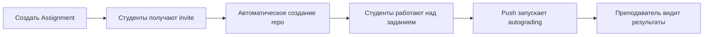

# GitHub Education

[prev: 05-github-sponsors](./05-github-sponsors.md) | [next: 01-github-api](../12-github-developer-tools/01-github-api.md)
---

## Что такое GitHub Education?

**GitHub Education** - это комплекс образовательных программ и инструментов от GitHub, предназначенных для студентов, преподавателей и учебных заведений. Программа предоставляет бесплатный доступ к профессиональным инструментам разработки.

### Основные программы

- **GitHub Student Developer Pack** - для студентов
- **GitHub Campus Program** - для учебных заведений
- **GitHub Classroom** - для преподавателей
- **GitHub Campus Experts** - для студенческих лидеров

## GitHub Student Developer Pack

### Что это?

**Student Developer Pack** - это набор бесплатных инструментов и сервисов от GitHub и партнеров для студентов. Включает более 100 предложений.

### Что входит в пакет

#### От GitHub

| Инструмент | Обычная цена | Для студентов |
|------------|--------------|---------------|
| GitHub Pro | $4/месяц | Бесплатно |
| GitHub Copilot | $10/месяц | Бесплатно |
| Codespaces | 120 core-hours | Дополнительные часы |
| Private repositories | Unlimited | Unlimited |

#### Облачные платформы

| Сервис | Предложение |
|--------|-------------|
| Microsoft Azure | $100 кредитов |
| DigitalOcean | $200 кредитов на 1 год |
| Heroku | До 2 лет бесплатно |
| MongoDB Atlas | $50 кредитов |

#### Инструменты разработки

| Сервис | Предложение |
|--------|-------------|
| JetBrains IDEs | Все IDE бесплатно |
| GitKraken | Pro версия бесплатно |
| GitHub Desktop | Бесплатно (всегда) |
| Termius | Premium бесплатно |

#### Дизайн и прототипирование

| Сервис | Предложение |
|--------|-------------|
| Figma | Education план |
| Canva | Pro версия |
| Icons8 | 3 месяца подписки |

#### Обучение

| Сервис | Предложение |
|--------|-------------|
| Frontend Masters | 6 месяцев бесплатно |
| DataCamp | 3 месяца бесплатно |
| Educative | 6 месяцев бесплатно |
| Interview Cake | 3 недели бесплатно |

#### Домены и хостинг

| Сервис | Предложение |
|--------|-------------|
| Namecheap | .me домен бесплатно на год |
| Name.com | Домен + SSL |
| .tech | Домен бесплатно |

### Как получить Student Developer Pack

#### Требования

1. Возраст 13+ лет
2. Текущее обучение в учебном заведении
3. Подтвержденный email от учебного заведения (.edu) ИЛИ
4. Документы, подтверждающие статус студента

#### Процесс регистрации

1. Перейдите на [education.github.com](https://education.github.com)
2. Нажмите **Get benefits** > **Students**
3. Войдите в GitHub аккаунт
4. Выберите тип верификации:
   - School email (предпочтительно)
   - Документы (студенческий билет, справка)
5. Заполните информацию об учебном заведении
6. Опишите, как планируете использовать GitHub
7. Дождитесь подтверждения (обычно 1-7 дней)

#### Советы для успешной заявки

```markdown
# Хорошая заявка включает:

✓ Фото студенческого билета (четкое, с датой)
✓ Подробное описание использования:
  - "Я изучаю Computer Science и буду использовать GitHub
     для проектов по курсам, хакатонов и личного портфолио"

✗ Избегайте:
- Размытых фото
- Общих фраз типа "для учебы"
- Документов с истекшим сроком
```

### Продление Student Pack

- Действует пока вы студент
- Нужно подтверждать статус ежегодно
- Перед окончанием придет напоминание

## GitHub Campus Program

### Для учебных заведений

**Campus Program** предоставляет бесплатные инструменты GitHub для всего учебного заведения.

### Что включено

- **GitHub Team** бесплатно для всей организации
- Неограниченные приватные репозитории
- GitHub Pages для каждого студента
- Неограниченные collaborators
- Техническое обучение для преподавателей

### Как присоединиться

1. Администратор учебного заведения заполняет заявку
2. Подтверждение статуса учебного заведения
3. Настройка организации GitHub для школы/университета

### Возможности для студентов

```
university-name/
├── course-projects/
│   ├── cs101-intro/
│   ├── cs201-algorithms/
│   └── cs301-databases/
├── student-portfolios/
│   ├── student1/
│   └── student2/
└── research-groups/
    ├── ml-research/
    └── security-lab/
```

## GitHub Classroom

### Что это?

**GitHub Classroom** - это инструмент для преподавателей, который автоматизирует создание и управление учебными заданиями через GitHub.

### Основные возможности

- Автоматическое создание репозиториев для студентов
- Шаблоны заданий (starter code)
- Автоматическое тестирование
- Интеграция с LMS
- Обратная связь через code review

### Создание Classroom

1. Перейдите на [classroom.github.com](https://classroom.github.com)
2. Авторизуйтесь через GitHub
3. Создайте организацию для курса
4. Настройте Classroom

### Создание задания

```yaml
# Структура assignment

Assignment:
  name: "Homework 1: Git Basics"
  type: Individual  # или Group
  visibility: Private

  starter_code:
    repository: "template-hw1"

  deadline: "2024-02-01 23:59"

  autograding:
    tests:
      - name: "Test 1"
        setup: "pip install -r requirements.txt"
        run: "pytest tests/"
        timeout: 10
        points: 50
```

### Autograding

GitHub Classroom поддерживает автоматическую проверку через GitHub Actions:

```yaml
# .github/classroom/autograding.json
{
  "tests": [
    {
      "name": "Unit Tests",
      "setup": "pip install pytest",
      "run": "pytest tests/",
      "input": "",
      "output": "",
      "comparison": "included",
      "timeout": 10,
      "points": 50
    },
    {
      "name": "Style Check",
      "setup": "pip install flake8",
      "run": "flake8 src/",
      "input": "",
      "output": "",
      "comparison": "exact",
      "timeout": 5,
      "points": 20
    }
  ]
}
```

### Workflow для преподавателя



### Пример starter code

```markdown
# Assignment: Implement a Calculator

## Objectives
- Practice Python functions
- Learn unit testing
- Use Git workflow

## Instructions
1. Implement functions in `calculator.py`
2. Run tests with `pytest`
3. Push your solution before deadline

## Files
- `calculator.py` - Your implementation here
- `tests/test_calculator.py` - Tests (don't modify)
- `README.md` - This file
```

```python
# calculator.py (starter code)
def add(a: float, b: float) -> float:
    """Add two numbers."""
    # TODO: Implement this function
    pass

def subtract(a: float, b: float) -> float:
    """Subtract b from a."""
    # TODO: Implement this function
    pass

def multiply(a: float, b: float) -> float:
    """Multiply two numbers."""
    # TODO: Implement this function
    pass

def divide(a: float, b: float) -> float:
    """Divide a by b. Raise ValueError if b is 0."""
    # TODO: Implement this function
    pass
```

### Roster Management

```yaml
# roster.yml - Связь GitHub username со студентами

students:
  - github_username: student1
    name: "Иван Иванов"
    email: "ivanov@university.edu"
    student_id: "2024001"

  - github_username: student2
    name: "Мария Петрова"
    email: "petrova@university.edu"
    student_id: "2024002"
```

### Просмотр результатов

Преподаватель может видеть:
- Статус сдачи каждого студента
- Результаты autograding
- История коммитов
- Время последнего push
- Feedback и комментарии

## GitHub Campus Experts

### Что это?

**Campus Experts** - это программа для студенческих лидеров, которые хотят развивать техническое сообщество в своем университете.

### Преимущества

- Обучение лидерству и community building
- Свагов и ресурсы для проведения мероприятий
- Нетворкинг с другими Campus Experts
- Поддержка от GitHub

### Требования

- Текущий студент
- Активное участие в техническом сообществе
- Желание организовывать мероприятия

### Чем занимаются Campus Experts

- Проведение воркшопов по Git/GitHub
- Организация хакатонов
- Менторство для других студентов
- Развитие open source культуры

## Бесплатные ресурсы для студентов

### GitHub Learning Lab (GitHub Skills)

```markdown
# Бесплатные курсы

## Beginner
- Introduction to GitHub
- Communicate using Markdown
- GitHub Pages

## Intermediate
- Reviewing pull requests
- Managing merge conflicts
- Securing your workflows

## Advanced
- GitHub Actions
- GitHub Packages
- DevOps with GitHub
```

### Полезные репозитории

```markdown
# Ресурсы для обучения

## Awesome Lists
- awesome-for-beginners - проекты для начинающих
- awesome-courses - бесплатные курсы CS
- free-programming-books - бесплатные книги

## Practice
- TheAlgorithms - алгоритмы на разных языках
- project-based-learning - learn by doing
- coding-interview-university - подготовка к интервью
```

### Microsoft Learn

Доступно через Student Pack:
- Azure Fundamentals
- AI Fundamentals
- Data Fundamentals
- Security Fundamentals

### Сертификации

Некоторые сертификации доступны бесплатно или со скидкой:
- GitHub Foundations Certification
- Microsoft Azure Certifications
- MongoDB Developer Certification

## Советы для студентов

### 1. Создайте сильный профиль

```markdown
# username

## About Me
🎓 Computer Science student at University
💻 Interested in web development and ML
🌱 Currently learning React and Python

## Projects
- [Project 1](link) - Description
- [Project 2](link) - Description

## Stats

```

### 2. Участвуйте в Open Source

```bash
# Найдите проекты для начинающих
github.com/topics/good-first-issue
github.com/topics/help-wanted
github.com/topics/hacktoberfest
```

### 3. Документируйте обучение

```
learning-journal/
├── README.md
├── courses/
│   ├── course-1-notes.md
│   └── course-2-notes.md
├── projects/
│   ├── project-1/
│   └── project-2/
└── resources/
    └── useful-links.md
```

### 4. Используйте GitHub для резюме

- Закрепите лучшие репозитории
- Пишите подробные README
- Показывайте progression
- Ведите активную историю коммитов

### 5. Нетворкинг

- Следите за интересными разработчиками
- Участвуйте в discussions
- Посещайте GitHub мероприятия
- Присоединяйтесь к Discord/Slack сообществам

## Полезные ссылки

- [GitHub Education](https://education.github.com)
- [Student Developer Pack](https://education.github.com/pack)
- [GitHub Classroom](https://classroom.github.com)
- [GitHub Campus Experts](https://education.github.com/experts)
- [GitHub Skills](https://skills.github.com)
- [GitHub for Teachers](https://education.github.com/teachers)

---
[prev: 05-github-sponsors](./05-github-sponsors.md) | [next: 01-github-api](../12-github-developer-tools/01-github-api.md)